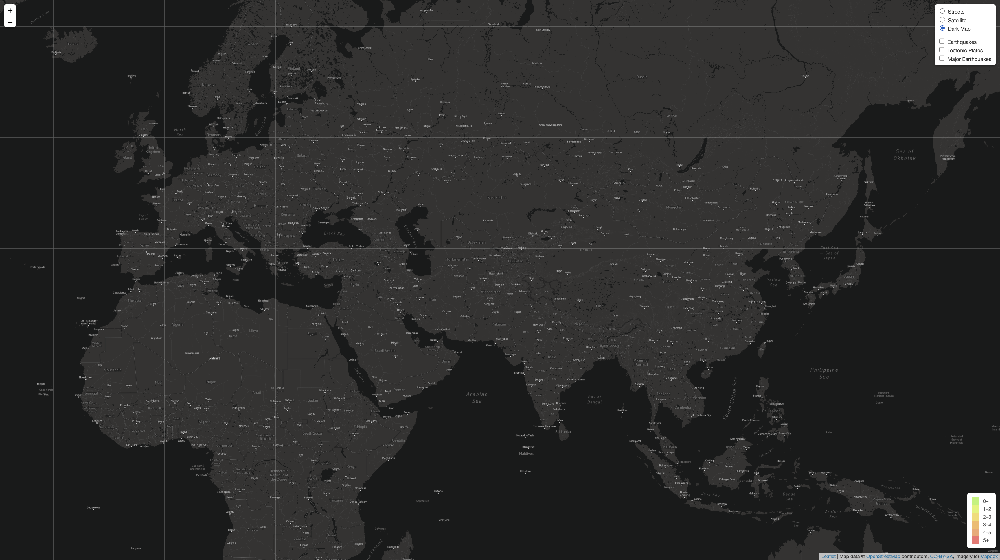
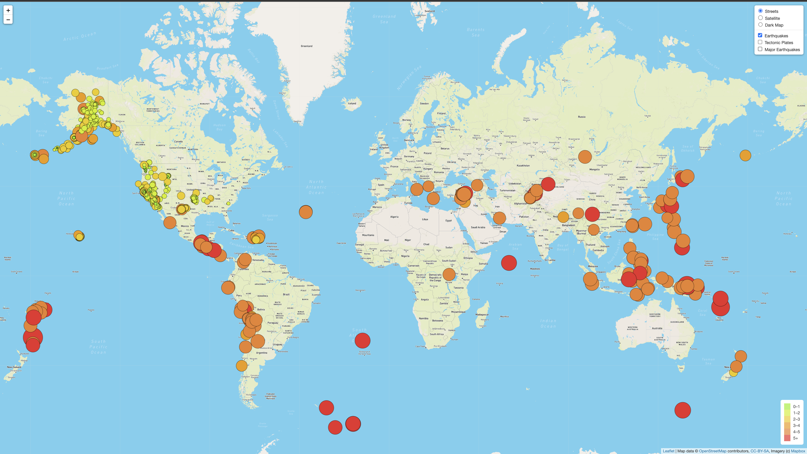
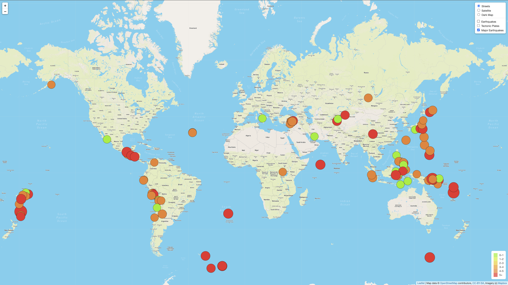
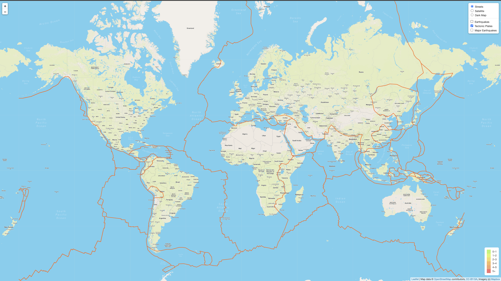

# Mapping Earthquakes

The goal of this analysis is to create three more maps based on the seismic map. The first is to detect the location of tectonic plates on Earth, the second is to show earthquakes greater than magnitude 4.5, and the third is to add a map containing dark layers.

#### Street Viwe Map

---
#### satellite Viwe Map

---
#### Darck Mode Map

---
#### Erthquakes

---
#### Major Erthquakes

---

#### Tectonic Plates

---

#### All Filtter

